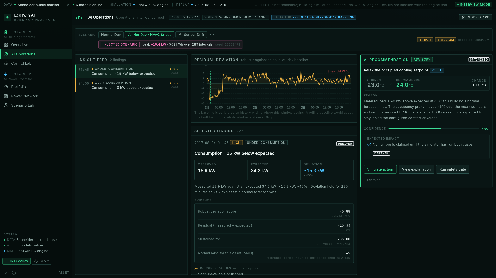
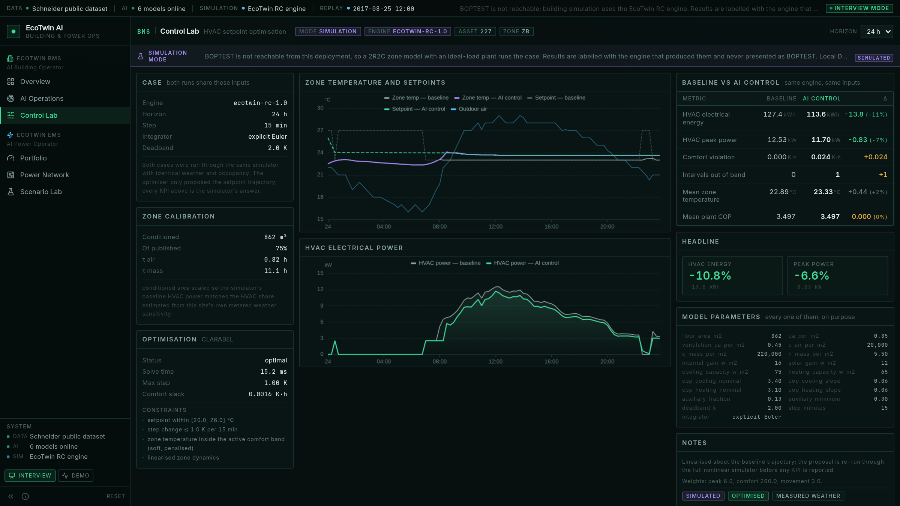
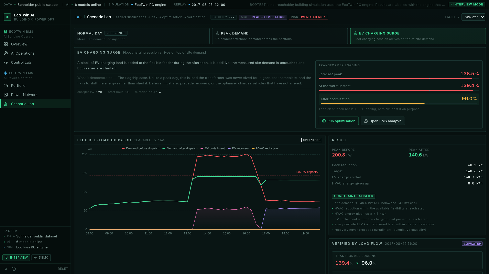
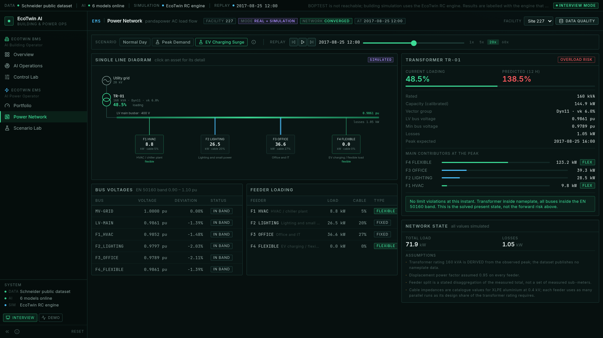
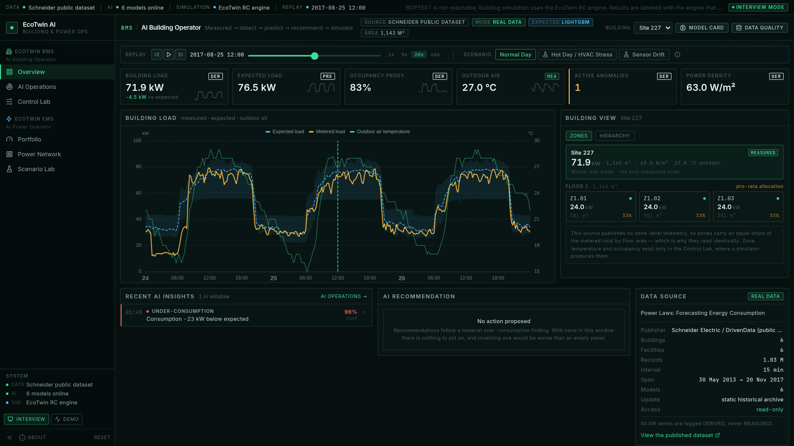
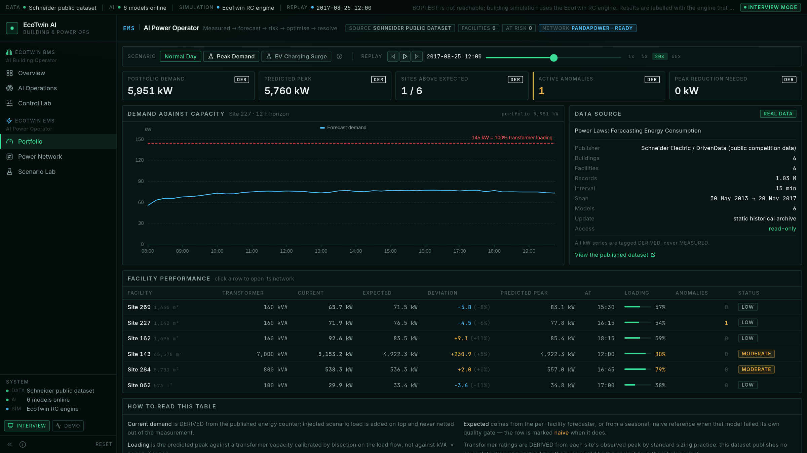
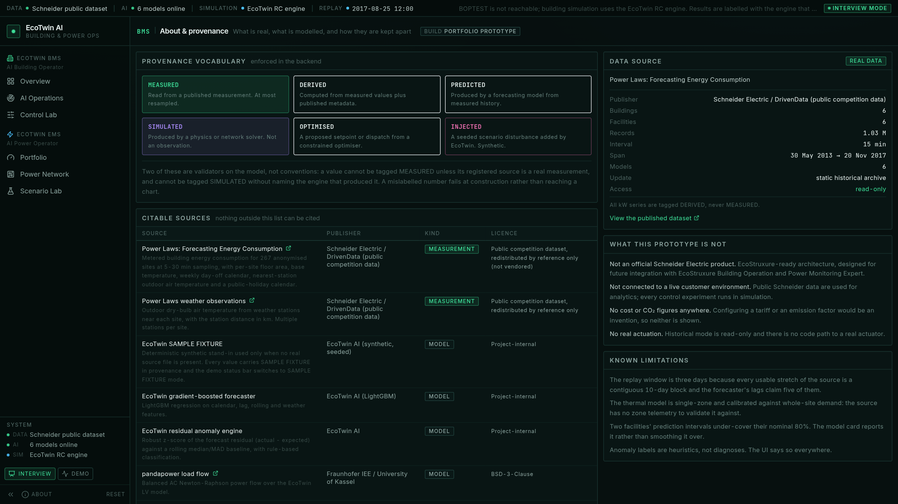
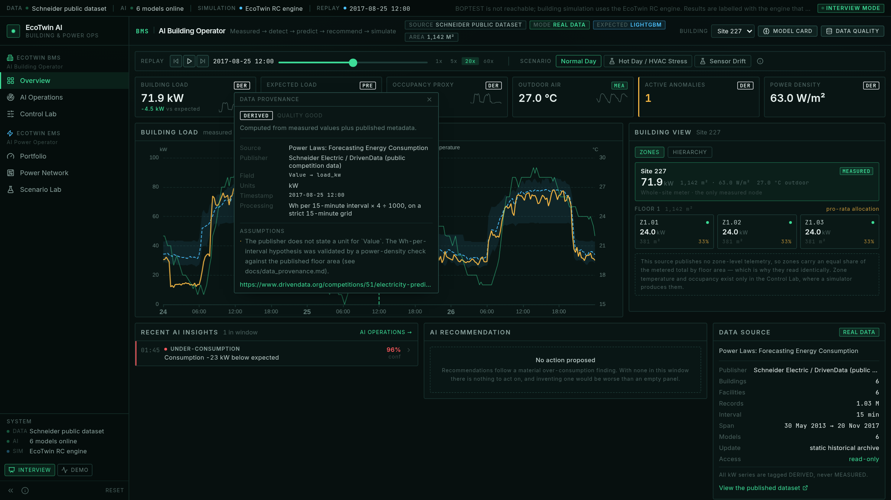
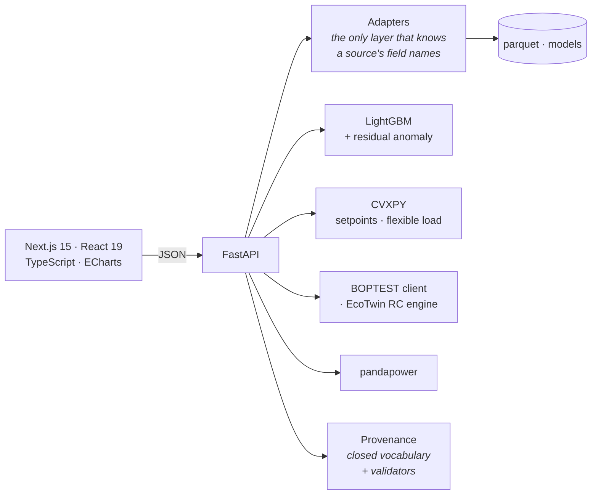

# EcoTwin AI

**AI Building & Power Operations Platform**

Two working end-to-end operational AI workflows over **real public Schneider
Electric data**: a building operator that detects, forecasts, recommends and
tests HVAC actions against a simulator, and a power operator that forecasts
demand onto an electrical network model, finds transformer risk and optimises
flexible load.

> **Not an official Schneider Electric product.** EcoStruxure-ready
> architecture, designed for future integration with EcoStruxure Building
> Operation and EcoStruxure Power Monitoring Expert.
>
> This portfolio prototype does not connect to a live Schneider Electric
> customer environment. Public Schneider data are used for analytics. Building
> and electrical control experiments are performed using simulation
> environments.

| | |
|---|---|
| **EcoTwin BMS** — AI Building Operator | Measured → Detect → Predict → Recommend → Simulate → Compare |
| **EcoTwin EMS** — AI Power Operator | Measured → Forecast → Detect Risk → Optimise → Simulate → Resolve |

---

## Why this project exists

Most energy dashboards blend three very different kinds of number and present
them identically: what a meter recorded, what a model believes, and what a
simulator produced. That blend is the reason operators distrust them.

EcoTwin separates them everywhere, and enforces the separation in the backend
rather than by convention. Every value carries provenance, and two rules are
validators on the model itself:

```python
# a value cannot claim to be measured if its source is not a measurement
if source_type is MEASURED and not descriptor.is_real_measurement:
    raise ValueError(...)
# a simulated value must name the engine that produced it
if source_type is SIMULATED and engine is None:
    raise ValueError(...)
```

A mislabelled number fails at construction rather than reaching a chart.

---

## What it actually does

### EcoTwin BMS

- **Historical replay** of 15-minute metered demand with published weather.
- **Day-ahead forecast** (LightGBM) with a **conformalised** 80% interval —
  calibration lifts empirical coverage from 55% to 83% on the worst site.
- **Residual anomaly detection** against an hour-of-day baseline calibrated on
  history that ends where the tested window begins, so a window-long fault
  cannot become the new normal.
- **Constrained recommendations** that claim no saving until a simulator has run.
- **A safety gate**: allowlist, min/max, rate limit, comfort envelope,
  simulation-target-only. Real historical mode is read-only.
- **Control Lab**: baseline vs AI control, both run through the same engine on
  identical inputs. −10.8% HVAC energy, −6.6% peak, for 0.02 K·h of comfort give-away.

### EcoTwin EMS

- **Portfolio** of six metered facilities with forecast peaks and risk grading.
- **pandapower LV network** — six buses, catalogue cable impedances, feeders
  sized with parallel circuits from each one's design share of the rating.
- **Transformer risk** over a 12-hour forward horizon, against a capacity
  **calibrated by bisection on the load flow** rather than `kVA × pf`.
- **Flexible-load optimisation** (CVXPY): EV energy conserved as a hard
  equality, recovery constrained to follow curtailment, HVAC bounded by a
  comfort energy budget.
- **Verification by a second load flow.** On the EV surge: TR-01 goes
  **139% → 96%**, LV voltage **0.958 → 0.972 pu**.

### The cross-module workflow

```
Power risk → Building analysis → AI recommendation → Control simulation → Power impact
   (EMS)          (BMS)              (BMS)                 (BMS)             (EMS)
```

Every link is a real computation: EMS names the flexible contributors, BMS
answers by running its simulator, and EMS re-solves the network with the
resulting HVAC reduction applied. A thermal simulation feeding an electrical
simulation.

### Screenshots

**BMS — AI Operations.** A seeded hot-day injection, the residual score against
its threshold, a finding with its full evidence, and a recommendation that
claims no saving until the simulator has run.



**BMS — Control Lab.** Baseline against AI control, both from the same engine
over identical inputs, with every model parameter on screen.



**EMS — Scenario Lab.** The flagship: an EV surge past nameplate, a dispatch
that defers rather than sheds, verification by a second load flow, and the
cross-module chain closing power → building → power.



**EMS — Power Network.** A single-line diagram driven by a real load flow;
feeder width follows its share of demand.



<details>
<summary>More: BMS Overview, EMS Portfolio, About &amp; provenance, and a provenance popover</summary>






</details>

---

## Data

**Source:** [Power Laws: Forecasting Energy Consumption](https://www.drivendata.org/competitions/51/electricity-prediction-machine-learning/)
— Schneider Electric / DrivenData public competition data. 267 anonymised
sites, 15-minute meters, floor areas, day-off and holiday calendars, and
nearest-station outdoor temperature.

Three decisions worth knowing about, all documented in
[`docs/data_provenance.md`](docs/data_provenance.md):

1. **The publisher states no unit for its energy counter.** The
   watt-hours-per-interval hypothesis was validated by a power-density check
   against published floor areas; sites that failed were **excluded, not
   rescaled**. Every kW figure is therefore `DERIVED`, never `MEASURED`.
2. **No Technopole dataset is publicly downloadable.** The adapter for it ships
   **dormant** and self-activates if files appear, rather than fabricating one.
3. **The source is 10-day blocks, not a continuous history.** That single
   constraint sets the 5-day feature lookback, the 3-day replay window and the
   6-site portfolio. The window search resolves all of it at once.

Nothing that the data cannot support is invented. There are no cost figures and
no CO₂ figures, because configuring a tariff or an emission factor would be an
invention. Occupancy is a stated proxy. The feeder split is a documented
disaggregation, not four sub-meters that do not exist.

---

## Architecture



The adapter boundary is the point of the whole design. `BuildingSourceAdapter`
and `PowerSourceAdapter` are four methods each; swapping the public dataset for
EcoStruxure Building Operation or Power Monitoring Expert is a change confined
to `core/adapters/`. Nothing above it knows where the numbers came from.

Full diagrams in [`docs/architecture.md`](docs/architecture.md).

---

## Running it

### Local engineering mode

```bash
cp .env.example .env
docker compose up --build             # web :3000 · api :8000
docker compose --profile boptest up   # ... with a live BOPTEST instance
```

### From source

```bash
make setup      # venv + npm install
make data       # download the public dataset (~1.4 GB)
make pipeline   # inspect → prepare → train → cache
make api        # :8000
make web        # :3000   (separate terminal)
```

**It runs without the data.** Delete `data/` and the adapter registry falls back
to seeded fixtures, every value is tagged `SAMPLE FIXTURE`, and the status bar
says so. The app never shows an empty state and never passes a fixture off as a
measurement.

### Tests, lint, types

```bash
make check      # ruff + black + eslint + strict tsc + pytest
```

137 Python tests. They assert properties rather than restating the
implementation:

- no feature can read the present (perturb the last sample; no earlier feature
  row may move);
- conformal calibration restores nominal coverage;
- a window-long fault is still flagged by the reference baseline where a
  rolling one goes quiet;
- relaxing a cooling setpoint saves a credible 2–30% per K;
- EV energy is conserved **and** recovery never precedes curtailment;
- a value cannot be tagged `MEASURED` from a source that is not a measurement.

---

## Demo

[`docs/interview_demo.md`](docs/interview_demo.md) is a 5-minute script with
talking points. In the app, press **Guided demo** for the same route, and
**Reset demo** in the status bar to clear every cache between runs.

Approximate route: BMS overview → replay → inject a hot day → detection →
recommendation → safety gate → Control Lab → EMS portfolio → network → EV surge
→ optimise → verify by load flow → cross-module chain → provenance.

---

## Three bugs worth reading about

These are in the commit history, and they are the most honest thing in the repo.

**The forecast said the setpoint did not matter.** Relaxing the cooling setpoint
by 1 K changed HVAC energy by 0.2%. The plant was a proportional controller,
which leaves a steady-state offset that swamped the experiment the Control Lab
exists to run. Replaced with an ideal-load formulation: about −13% per K.

**The model heated the building in August.** Heating setpoint was derived as
`cooling − deadband`, so a 27 °C summer setback implied a 25 °C heating
setpoint. That single bug had inflated the apparent AI saving from 10.8% to 39%.
Dual setpoints now come from the comfort band.

**The optimiser charged cars that had not arrived.** The dispatch chart showed
EV energy being recovered hours *before* any was curtailed. Energy balance does
not imply causality. Added a cumulative constraint — and that immediately
exposed a second bug, an 8-hour horizon ending before the charging session did,
which made a feasible problem report as infeasible.

All three were found by looking at output, not by a test going red. The tests
came after.

---

## Known limitations

- **3-day replay window.** The source is 10-day blocks; 5 days go to the
  forecaster's lags. A data constraint, not a design choice.
- **BOPTEST is not live in the hosted demo.** The client is real and local
  Docker mode runs it; hosted uses the RC engine and says so on screen.
- **The thermal model is single-zone and calibrated against whole-site demand**,
  because the source has no zone telemetry. It is credible physics, not a
  validated model of a specific building.
- **Two sites' prediction intervals under-cover** (68% and 73% against 80%).
  Reported in the model card rather than smoothed over.
- **Weather is the recorded observation** standing in for a vendor forecast.
- **Anomaly labels are heuristics, not diagnoses.** The UI says "possible
  causes" everywhere.
- **No authentication.** Every endpoint is public and read-only.

---

## Future EcoStruxure integration

| Today | Production |
|---|---|
| `PowerLawsBuildingAdapter` | `EcoStruxureBuildingOperationAdapter` |
| `FacilityPowerAdapter` | `PowerMonitoringExpertAdapter` |
| `BoptestEngine` / `RcThermalEngine` | Live plant, via the same interface |
| parquet + SQLite | PostgreSQL / TimescaleDB, behind the same adapter contract |
| joblib artefacts + JSON cards | Model registry with scheduled retraining |
| docker compose | Kubernetes: a Deployment per service, HPA on the API |

The AI, optimisation and simulation layers already depend on nothing
source-specific, so each row above is an adapter, not a rewrite.

**Explicitly out of scope for V1**, and documented as such: Kubernetes,
PostgreSQL, TimescaleDB, LSTMs, transformers, reinforcement learning, battery /
solar / carbon / tariff optimisation, BACnet, live EBO or PME integration,
accurate 3D geometry, a chatbot, a reporting engine, mobile-first layouts, and
more than three scenarios per module.

---

## Repository

```
apps/
  api/        FastAPI: routers, services, schemas
  web/        Next.js: app, components, features, lib
core/
  adapters/   building/ and power/ — the only source-aware layer
  models/     features, forecasting, anomaly detection
  optimisation/  bms.py, ems.py, validation.py
  provenance/ closed vocabulary + source registry
  scenarios/  seeded, deterministic disturbances
  common/     internal schema shared by everything
data/         raw (not vendored) · processed · fixtures
models/       trained artefacts + model cards
demo/         precomputed results for the hosted demo
scripts/      inspect · prepare · train · cache · download
tests/        137 tests
docs/         architecture · data provenance · modelling · deployment · demo
```

## Documentation

- [Architecture](docs/architecture.md) — diagrams, layering, measured latency
- [Data provenance](docs/data_provenance.md) — sources, the unit problem, what
  the data cannot support
- [Modelling](docs/modelling.md) — features, leakage, evaluation, conformal
  intervals, the thermal model
- [Deployment](docs/deployment.md) — both targets, configuration, operations
- [Interview demo](docs/interview_demo.md) — the 5-minute script
- [Schema report](docs/schema_report.md) — generated from the raw files
