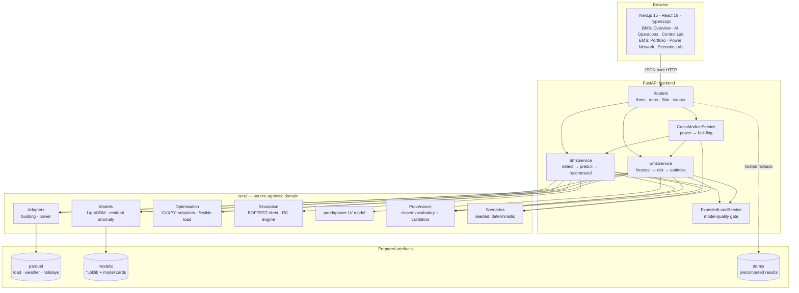
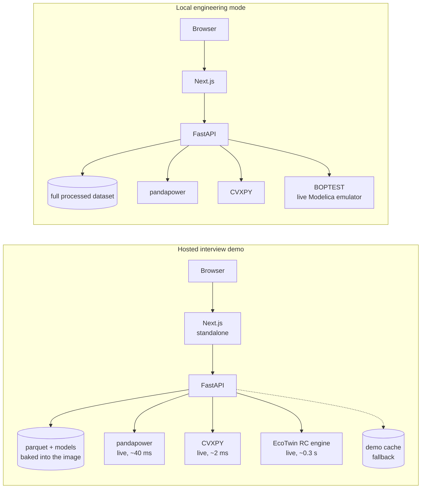
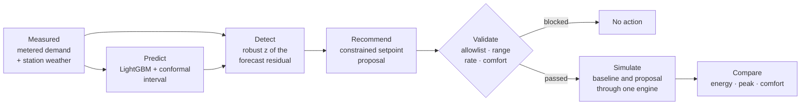
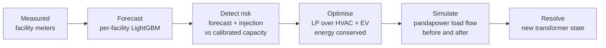
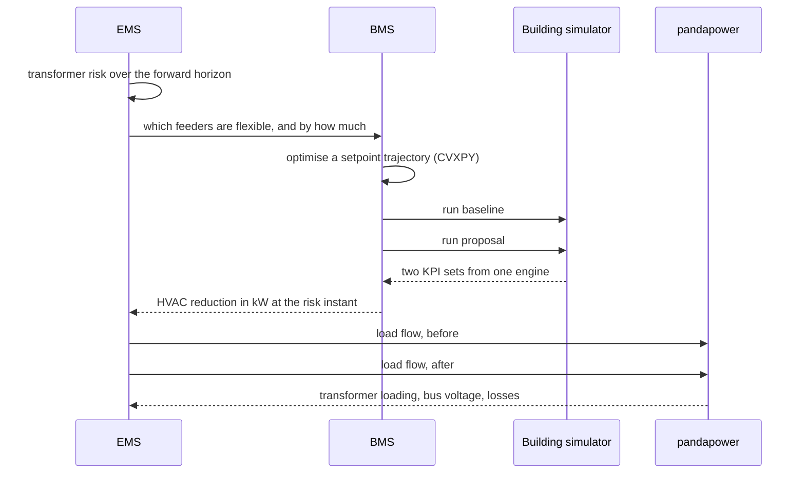
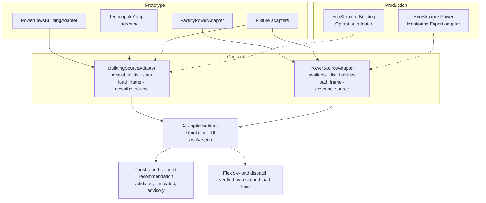

# Architecture

## The shape of it

## Two deployment targets, one codebase

The only difference is which simulation engine answers, and the platform
**says which one did**. A result from the RC engine is never labelled BOPTEST;
`SimulationResult.engine` carries the truth and provenance repeats it.

## The BMS flow

## The EMS flow

## The cross-module workflow

Every arrow is a real computation. The number that reaches the operator is the
output of a thermal simulation feeding an electrical simulation.

## Why the adapter boundary is where it is

Four methods each. The contract is deliberately narrow: metadata, a rectangular
time-series frame on a strict grid, and a description of the source. Everything
above it works on the common internal schema in `core/common/schemas.py` and has
no idea where the numbers came from.

## Layering rules

- `core/` never imports from `apps/`. It is the domain library; the API is one
  consumer and the scripts are another.
- Only `core/adapters/` knows a source's field names.
- Only `core/provenance/sources.py` may name a citable source.
- The API owns composition and HTTP concerns, not domain logic.
- The frontend owns presentation. It never computes a KPI, never converts a
  unit, and never decides a provenance badge.

## Performance, measured

Warm, median of three, against the local production build:

| Endpoint | Warm |
|---|---|
| `/healthz` (liveness; touches nothing) | 2 ms |
| `/health` (every component, including a real load flow) | 64 ms |
| `/bms/overview` | 184 ms |
| `/bms/insights` | 2 ms |
| `/bms/assets` | 27 ms |
| `/bms/control-lab` (2 simulations + a convex solve) | 838 ms |
| `/ems/portfolio` (6 facilities) | 48 ms |
| `/ems/network` (load flow) | 68 ms |
| `/ems/risk` | 29 ms |
| `/ems/optimise` (LP + 2 load flows) | 139 ms |
| `/interview/verify` (re-runs every demo claim) | 2.0 s |

Two caches earn most of that. The per-facility transformer capacity is found by
bisection on the load flow — about forty solves — and the anomaly detection
behind the overview and portfolio screens runs its classifier once per
anomalous step. Both are deterministic in their inputs, both are cached, and
both are warmed at start-up, so the first click of a demo is not the slow one.
Before the detection was cached the EMS portfolio cost 1.45 s on **every**
request; it is 48 ms now, and the answer is identical.

## What is deliberately not here

Kubernetes, PostgreSQL, TimescaleDB, LSTMs, transformers, reinforcement
learning, battery/solar/carbon/tariff optimisation, BACnet, live EBO or PME
integration, 3D geometry, a chatbot, a reporting engine. See
[Future work](#) in the README. Each of these is a real amount of work that
would not have made the two flows any more defensible.
