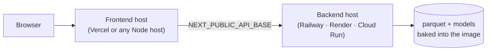

# Deployment

Two targets, one codebase. The only real difference is which simulation engine
answers, and the platform states which one did.

## Local engineering mode

```bash
cp .env.example .env
docker compose up --build            # web :3000, api :8000
docker compose --profile boptest up  # ... and a live BOPTEST instance
```

| Service | Port | Notes |
|---|---|---|
| `web` | 3000 | Next.js standalone output, no toolchain in the runtime image |
| `api` | 8000 | FastAPI + LightGBM + pandapower + CVXPY |
| `boptest` | 5000 | Opt-in profile: the image is large and slow to start |

Both images run as an unprivileged user with a health check. The backend's
health check has a 45 s start period because start-up warms the per-asset
caches, including the transformer-capacity bisection.

### Without Docker

```bash
make setup      # venv + npm install
make data       # download the public dataset (~1.4 GB)
make pipeline   # inspect → prepare → train → cache
make api        # :8000
make web        # :3000  (separate terminal)
```

### BOPTEST

`ECOTWIN_BOPTEST_URL` empty (the default) means the Control Lab uses the
EcoTwin RC engine. When it is set, the backend probes `/version` at start-up
and on every simulation:

- probe succeeds → BOPTEST runs the case, results are tagged `BOPTEST`;
- probe fails → the RC engine runs it, results are tagged `ECOTWIN_RC`, and the
  status bar and the Control Lab both say so.

A result is **never** labelled BOPTEST unless a BOPTEST instance answered.

## Hosted interview demo



Nothing is provider-specific: the backend is a single container listening on
`$PORT` with `/health`, and the frontend is Next.js standalone output.

### What makes it reliable

1. **No training, download or preprocessing at request time.** Processed
   parquet (12 MB) and trained models are baked into the image.
2. **Start-up warms the caches** — BMS context, zone calibration, EMS portfolio
   and the capacity bisection — so the first click is not the slow one.
3. **Live where it is fast.** pandapower solves in ~40 ms and the convex
   programs in ~2 ms, so both run live. Only the portfolio's cold path is
   expensive, and warm-up absorbs it.
4. **A demo cache as backstop.** `make cache` precomputes 14 results (~420 kB)
   through the same code paths. Replayed results keep their originating engine
   in provenance with `SIMULATION REPLAY` added.
5. **Degradation is visible, not silent.** No processed data → fixture adapters
   and a `SAMPLE FIXTURE` status bar. No models → seasonal-naive with the reason
   on screen. No BOPTEST → RC engine, labelled.
6. **Every panel fails independently.** A failed fetch shows the error and a
   retry, keeps the previous data on screen, and never blanks the page.

### Deploy the backend

```bash
docker build -t ecotwin-api .
docker run -p 8000:8000 \
  -e ECOTWIN_CORS_ORIGINS="https://your-frontend.example" \
  -e ECOTWIN_DEMO_MODE=true \
  ecotwin-api
```

Container platforms inject `$PORT`; the image honours it.

### Deploy the frontend

`NEXT_PUBLIC_*` is inlined at **build** time, so the API URL must be a build
argument — a compose service name will not reach a browser:

```bash
docker build -t ecotwin-web \
  --build-arg NEXT_PUBLIC_API_BASE=https://your-api.example \
  apps/web
```

On Vercel: root directory `apps/web`, and set `NEXT_PUBLIC_API_BASE` as a build
environment variable.

### Sizing, measured

| | Image | Memory | Note |
|---|---:|---:|---|
| api | 1.11 GB | ~700 MB | The scientific stack is nearly all of it: pandas, scipy, LightGBM, pandapower, CVXPY |
| web | 333 MB | ~120 MB | Next.js standalone output; no toolchain in the runtime layer |

The backend image is large and that is mostly unavoidable with this stack.
Vendored test suites, `.pyx` sources and byte-code caches are stripped after
install, which is worth 18% (1.36 GB → 1.11 GB). Going further would mean a multi-stage build
against a slimmer base, which is a real option but not one worth the fragility
here.

**Start-up takes ~16 s**, almost all of it warming caches: the BMS context and
zone calibration, then the EMS portfolio for all three scenarios including the
per-facility transformer-capacity bisection. The health check allows 45 s before
it starts probing. The pay-off is that the portfolio responds in ~1.4 s rather
than ~11 s on the first click — and scenario contexts are warmed too, because
warming only the baseline leaves the scenario a demo actually runs cold.

One backend worker on purpose: the services hold warmed per-asset caches and a
second worker would double memory for throughput a demo does not need.

## Configuration

| Variable | Default | Purpose |
|---|---|---|
| `ECOTWIN_DEMO_MODE` | `true` | Prefer precomputed results, never start a long job |
| `ECOTWIN_INTERVIEW_MODE` | `true` | Curated data, stable scenarios, no experimental surface |
| `ECOTWIN_CORS_ORIGINS` | localhost:3000 | Comma-separated browser origins |
| `ECOTWIN_BOPTEST_URL` | empty | BOPTEST REST base URL; empty uses the RC engine |
| `ECOTWIN_LOG_LEVEL` | `INFO` | |
| `ECOTWIN_ROOT` | repo root | Override when running from outside the repo |
| `NEXT_PUBLIC_API_BASE` | localhost:8000 | Build-time API URL for the browser |

No secrets: the prototype talks to no authenticated service.

## Health and observability

- `GET /health` — adapters, model count, data mode, whether BOPTEST is
  reachable, and whether the demo cache is present.
- `GET /status` — what the status bar shows, including the notes it displays
  when something is degraded.
- `GET /sources` — the full citation registry and what was actually used.
- Every response carries `X-Response-Time-Ms`.

## Operational notes

- **`next start` leaves a `next-server` holding port 3000.** A subsequent start
  fails with `EADDRINUSE` and the browser keeps getting the *previous* build's
  chunks — which looks exactly like a frontend bug. `scripts/dev_restart.sh`
  frees the ports first. This cost real time; it is written down so it does not
  cost it again.
- **`POST /demo/reset`** drops every service and adapter cache. Use it between
  demo runs, or press *Reset demo* in the status bar.
- **Disk:** the raw dataset is ~1.4 GB and is not vendored. Processed parquet is
  ~13 MB and is committed, so a fresh clone runs without downloading anything.

## Future production deployment

Out of scope here, and deliberately so:

- **Kubernetes** — a Deployment per service, an HPA on the API, and the parquet
  moved to object storage with a PVC cache.
- **PostgreSQL / TimescaleDB** — the adapter contract already returns frames, so
  this is a new adapter rather than a rewrite.
- **Model registry and scheduled retraining** — model cards are already emitted
  as JSON next to each artefact, which is the input a registry needs.
- **Authentication** — none exists; every endpoint is public and read-only.
